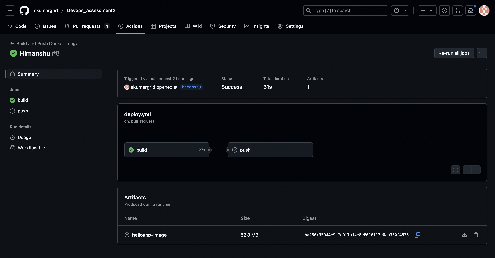
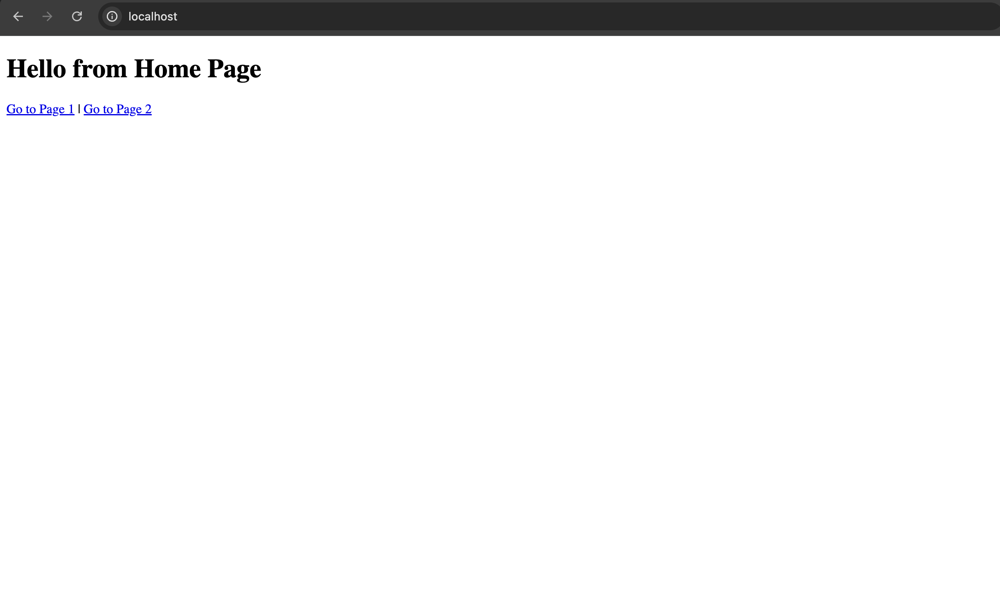

# FastAPI CI/CD with GitHub Actions + Kubernetes + Ingress

This project demonstrates a complete CI/CD pipeline using **GitHub Actions** to build and push a Docker image of a FastAPI web app with **3 simple pages**, and then deploy it locally to a **Kubernetes cluster** using:

- Kubernetes **Deployment** (2 replicas)
- **ClusterIP Service**
- **Ingress** for accessible routing to different pages

---

## 🧑‍🤝‍🧑 Team Contribution

| Member      | Responsibility                                                               |
|-------------|-------------------------------------------------------------------------------|
| **Shubham** | GitHub Actions CI/CD setup, Docker image creation, Docker Hub integration     |
| **Himanshu** | Kubernetes Deployment, Service, and Ingress configuration for exposing app    |

---

## CI/CD Pipeline Overview

| Step                  | Action                                                                 |
|-----------------------|------------------------------------------------------------------------|
| 1️⃣ Build              | Docker image is built using GitHub Actions on every push or PR         |
| 2️⃣ Push               | Image is pushed to Docker Hub **only on `main` branch push**            |
| 3️⃣ Pull Request       | On PR to `main`, **image is built but not pushed**                      |
| 4️⃣ Kubernetes Deploy  | Image is deployed using `kubectl apply` with 2 replicas and Ingress     |

---

## ⚙️ GitHub Actions Workflow

Located in `.github/workflows/deploy.yml`:

- **Trigger**: on `push` and `pull_request`
- **Push to main**: Builds, saves as tarball, and pushes to Docker Hub
- **Pull request**: Builds only

Secrets used:
- `DOCKER_USERNAME`
- `DOCKER_PASSWORD`

---

## ☸️ Kubernetes Deployment

All Kubernetes manifests are in the `k8s/` folder:

### `deployment.yaml`
- Deploys **2 replicas** of the image `shukumar30/helloappshubham:latest`

### `service.yaml`
- Exposes deployment via **ClusterIP**

### `ingress.yaml`
- Routes:

| Route            | Page Description     |
|------------------|----------------------|
| `/`              | Home Page            |
| `/page_1`        | Page 1               |
| `/page_2`        | Page 2               |

> Ingress must be enabled (e.g., via `minikube addons enable ingress`)

---

## 🌐 Accessing the Pages via Ingress

Make sure your `/etc/hosts` has:
127.0.0.1  localhost


Then access in your browser:

- [http://localhost](http://localhost) → Home Page
- [http://localhost/page_1](http://localhost/page_1) → Page 1
- [http://localhost/page_2](http://localhost/page_2) → Page 2

---

## 🖼️ Screenshots

### 📄 Pipeline When Code Pushed


### 📄 Pipeline When Code Pulled


### 🏠 Home Page


### 📄 Page 1


### 📄 Page 2


---

## 🐳 Docker Image

Image pushed to Docker Hub:


---

## ✅ To Run Locally with Kubernetes

```bash
kubectl apply -f k8s/deployment.yaml
kubectl apply -f k8s/service.yaml
kubectl apply -f k8s/ingress.yaml


